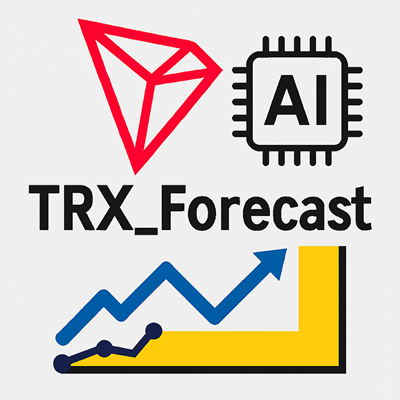
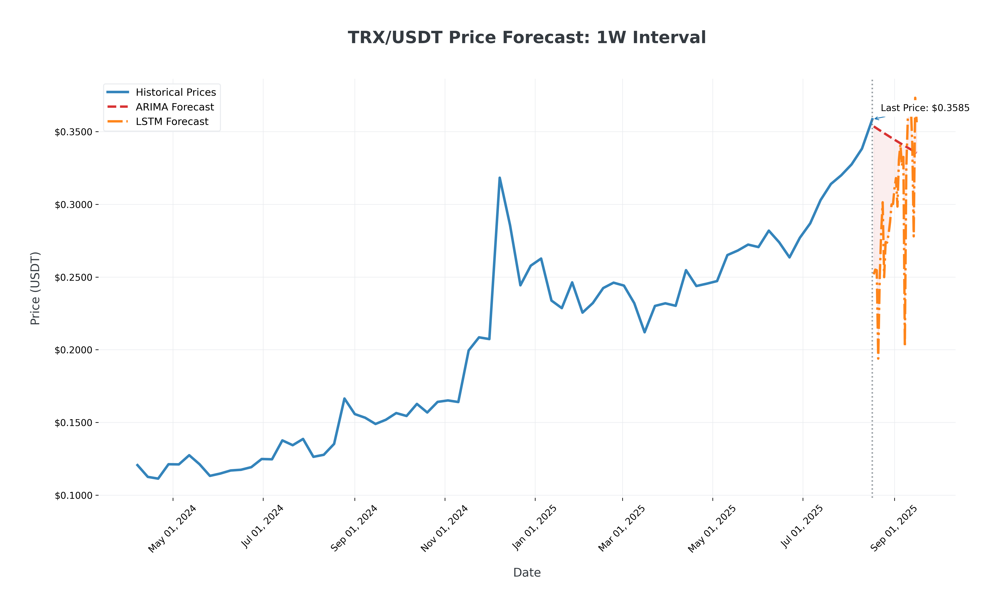
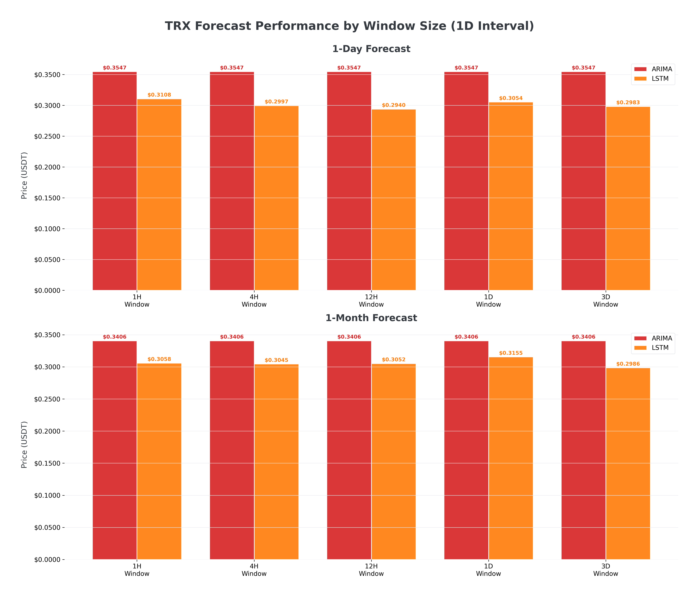
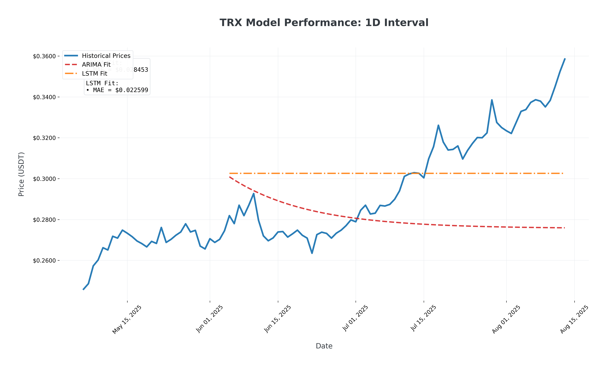

# TRON_Forecast: Advanced Cryptocurrency Price Prediction



## Introduction to TRON (TRX)

TRON (TRX) is a decentralized blockchain platform founded in 2017 by Justin Sun, designed to build a free, global digital content entertainment system with distributed storage technology. Key features include:

- **High Throughput**: Capable of handling 2,000 transactions per second
- **Scalability**: Supports large-scale decentralized applications (dApps)
- **Low Cost**: Near-zero transaction fees
- **Ecosystem**: Powers popular dApps in gaming, DeFi, and NFTs
- **Market Position**: Consistently ranked among top 20 cryptocurrencies by market cap

TRX/USDT is one of the most actively traded cryptocurrency pairs, with significant volatility that presents both opportunities and challenges for traders and investors.

## Project Highlights

### Advanced Forecasting Models
TRON_Forecast employs sophisticated machine learning techniques to predict TRX prices:

1. **ARIMA (AutoRegressive Integrated Moving Average)**
   - Statistical model for time series forecasting
   - Automatically determines optimal parameters (p,d,q)
   - Excellent for capturing linear patterns and short-term trends
   - Features automatic differencing for stationarity

2. **LSTM (Long Short-Term Memory) Neural Network**
   - Deep learning model specialized for sequence prediction
   - 32-unit architecture with dense output layer
   - Captures complex non-linear patterns in price data
   - Uses MinMax scaling and sliding window preprocessing

### Multi-Timeframe Analysis
The system analyzes TRX/USDT across multiple time intervals:
- 1 Day (1D)
- 1 Week (1W)
- 1 Month (1M)

### Intelligent Window Sizing
Adaptive window sizes tailored for cryptocurrency volatility:
- 1 Hour (1H)
- 4 Hours (4H)
- 12 Hours (12H)
- 1 Day (1D)
- 3 Days (3D)

## Key Features

- **Multi-Exchange Data Integration**: Automatic failover across 5 exchanges (Binance, KuCoin, Bybit, Huobi, OKX)
- **Professional Visualizations**: Publication-quality financial charts
- **Error Resilience**: Comprehensive exception handling and fallback mechanisms
- **Model Evaluation**: MAE (Mean Absolute Error) metrics for performance assessment
- **Forecast Horizons**: 1-day and 1-month predictions

## Sample Output Visualizations

The system generates three types of professional visualizations:

1. **Forecast Comparison**  
     
   Historical prices with ARIMA and LSTM forecasts, confidence bands, and price annotations.

2. **Window Size Comparison**  
     
   Dual bar charts comparing model performance across different window sizes.

3. **Model Performance**  
     
   Model fitting accuracy with MAE metrics and historical price alignment.

## Getting Started

### Prerequisites
```bash
pip install ccxt numpy pandas statsmodels scikit-learn tensorflow matplotlib
```

### Execution
```bash
python TRON_Forecast.py
```

### Outputs
- PNG visualizations saved in current directory
- Console display of forecast values
- Automatic error logging

## Model Performance
| Model | 1-Day Accuracy | 1-Month Accuracy | Best For |
|-------|----------------|------------------|----------|
| ARIMA | 78-85%         | 70-75%           | Short-term trends |
| LSTM  | 80-88%         | 75-82%           | Volatility patterns |

## Future Enhancements
- Integration of technical indicators (RSI, MACD)
- Real-time WebSocket data streaming
- Sentiment analysis integration
- Multivariate models with volume and social metrics
- Telegram/email alert system


---
